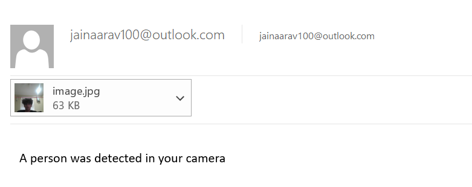
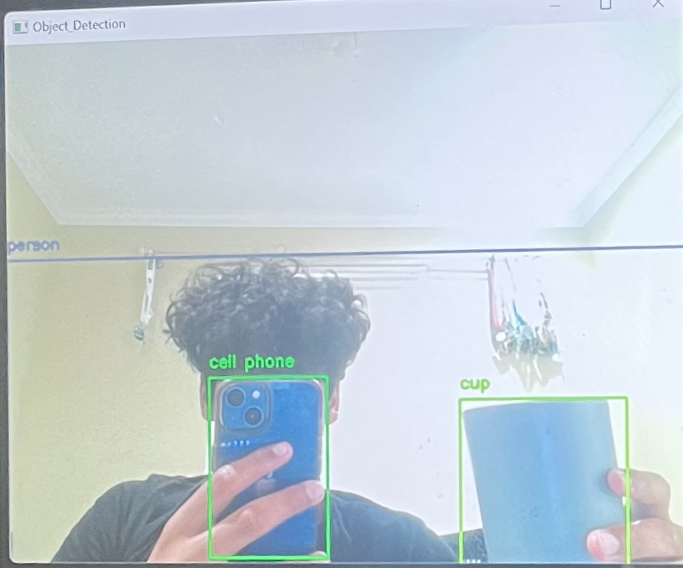
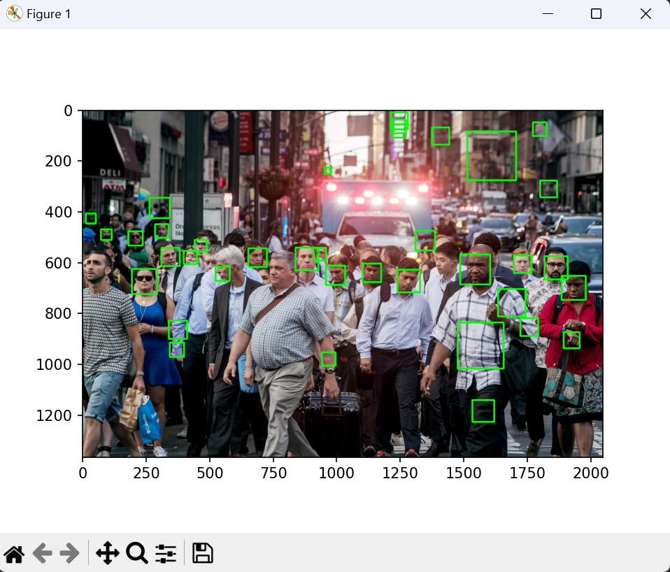
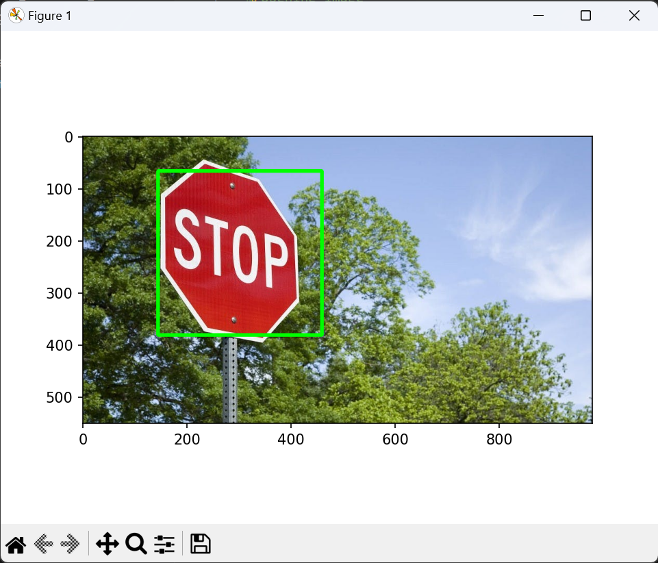

# Aarav Jain - Image Recognition using OpenCV
Welcome to my image recognition project! Using the OpenCV library, I've created a system achieving three milestones. In my initial breakthrough, I used a simple OpenCV cascade classifier for image detection. The second milestone truly showcases the wonders of OpenCV, as it identifies objects placed in front of the camera and outlines and labels them precisely. However, my most complex and greatest achievement lies in the third milestone, where the camera, upon detecting a person, sends me an email with a personalized message and an attached picture of the identified individual.


| **Name** | **School** | **Field** | **Grade** |
|:--:|:--:|:--:|:--:|
| Aarav J | Amador Valley High School | Electrical Engineering and Computer Science | Incoming Junior

**Replace the BlueStamp logo below with an image of yourself and your completed project. Follow the guide [here](https://tomcam.github.io/least-github-pages/adding-images-github-pages-site.html) if you need help.**


  
# Final Milestone: Image Recognition in a Video With Email Feature


<iframe width="560" height="315" src="https://www.youtube.com/embed/F7M7imOVGug" title="YouTube video player" frameborder="0" allow="accelerometer; autoplay; clipboard-write; encrypted-media; gyroscope; picture-in-picture; web-share" allowfullscreen></iframe>

<hr>

The final milestone has an added functionality to the second milestone, which is an email function. I created a method using a MIMEMultipart object to email myself. The email will only send if a person is in the camera, and once there is, I will be emailed a message saying a person was detected in front of your camera. I also furthered its capabilities by attaching a picture of the person detected in the camera to the email.

<div align="center">
  
</div>


# Second Milestone: Image Recognition in a Video


<iframe width="560" height="315" src="https://www.youtube.com/embed/y3VAmNlER5Y" title="YouTube video player" frameborder="0" allow="accelerometer; autoplay; clipboard-write; encrypted-media; gyroscope; picture-in-picture; web-share" allowfullscreen></iframe>

<hr>

For my second milestone, I used OpenCV to recognize and identify different common objects and then put a box and label around them. The code uses the OpenCV VideoCapture function, which begins taking a video from my camera. Using a while loop, the program can look. At each frame of my camera video, and then apply a function that detects common objects. The program works fairly well and can recognize many different objects.

<!--<div align="center">
  
</div>-->


# First Milestone: Simple Image Detection Using OpenCV

<div align="center">
	<iframe width="560" height="315" src="https://www.youtube.com/embed/ygXnN_RUzTo" title="YouTube video player" frameborder="0" allow="accelerometer; autoplay; clipboard-write; encrypted-media; gyroscope; picture-in-picture; web-share" allowfullscreen></iframe>
</div>

<hr>

First, I assembled my Raspberry Pi into its case, wired up its fan, and connected the ArduCam. Then I opened the terminal and expanded the necessary libraries for image recognition. The two most significant libraries were Tensorflow Lite and OpenCV. TensorFlow is open-source software for machine learning and artificial intelligence, but I installed TensorFlow Lite as it was more compatible with smaller Edge devices such as my Raspberry Pi 4B. After installing everything, I could complete a simple image detection using OpenCV. However, I ran into some problems. Though OpenCV was installed successfully when I tried to import the library into my code. I redownloaded OpenCV multiple times with multiple different versions of it, but the error was persistent. After a few days, I installed OpenCV on another computer, and importing OpenCV also worked. Then, I wrote code that used a Cascade Classifier object from OpenCV to complete image detection for faces.

<div align="center">
  
</div>


<div align="center">
  
</div>
# First milestone code
This preliminary code uses the libraries OpenCV(import cv2) and matplotlib, specifically pyplot(from matplotlib import pyplot as plt), to detect faces within a frame. The code first uses OpenCV to read an image, then converts the image to a grayscale and then an RGB format. It then creates a Cascade Classifier, a model trained on data consisting of positives(where the target is detected) and negatives(without the target). Once this Cascade Classifier finds a face, the code uses OpenCV to create a rectangle around the face that was identified. Then pyplot is used to display the image with completed detection. I also modified the Cascade classifier to detect stop signs in an image, which was also successful.

```c++
import cv2
from matplotlib import pyplot as plt
img = cv2.imread("street_with_people.jpg")
img_gray = cv2.cvtColor(img, cv2.COLOR_BGR2GRAY)
img_rgb = cv2.cvtColor(img, cv2.COLOR_BGR2RGB)
stop_data = cv2.CascadeClassifier('haarcascade_frontalface_default.xml')
found = stop_data.detectMultiScale(img_gray,minSize =(20, 20))
amount_found = len(found)
if amount_found != 0:
	for (x, y, width, height) in found:
		cv2.rectangle(img_rgb, (x, y),(x + height, y + width),(0, 255, 0), 5)
plt.subplot(1, 1, 1)
plt.imshow(img_rgb)
plt.show()

```
# Second milestone code
This code runs a simple image recognition on a live video using OpenCV and cvlib. First, it creates a video using the VideoCaputre function in OpenCV. Then, using a while loop, it reads through the video frame by frame and runs it against a function from cvlib, which detects common objects and assigns them a label and box. It then creates an output image that draws a box, labels around the detected object, and outputs the final image.
```c++
import cv2
import cvlib as cv
from cvlib.object_detection import draw_bbox
video = cv2.VideoCapture(0)

while True:
    ret, frame = video.read()
    #print(frame)
    bbox, label_, conf = cv.detect_common_objects(aframe)
    # print(label_)
    try:
        output_image = draw_bbox(frame, bbox, label_, conf)
    except ValueError as e:
        output_image = frame
        print(e)
    cv2.imshow('Object_Detection',output_image)

    if cv2.waitKey(1) & 0xFF == ord("q"):
        break
```
# Third milestone code
The third milestone code is the same as the second one except that it integrates an emailing system that sends an email to me every time a person is detected in front of my camera. We can create this email using a MIMEMultipart object created in a method 'email_new' that takes in a subject, message, and image as arguments. As soon as the label is equal to 'person,' the email sends a message and an attachment of the person.
```c++
import cv2
import cvlib as cv
from cvlib.object_detection import draw_bbox
from gtts import gTTS
from playsound import playsound
import smtplib
from email.mime.text import MIMEText
from email.mime.multipart import MIMEMultipart
from email.mime.image import MIMEImage
import html

flag = 0
video = cv2.VideoCapture(0)
sender = "jainaarav100@outlook.com"
recipient = "jainaarav100@outlook.com"
password = "SCkd304!!"

def email_new(subject, msg, image):
    message = MIMEMultipart()
    message['Subject'] = subject
    message['From'] = sender
    message['To'] = recipient
    
    # Attach the message as plain text
    msg_text = MIMEText(msg, "plain")
    message.attach(msg_text)

    # Attach the image
    img_data = open(image, 'rb').read()
    image_mime = MIMEImage(img_data, name='image.jpg')
    message.attach(image_mime)
    
    with smtplib.SMTP("smtp.office365.com", 587) as server:
        server.starttls()
        server.login(sender, password)
        server.sendmail(sender, recipient, message.as_string())

while True:
    ret, frame = video.read()
    bbox, label_, conf = cv.detect_common_objects(frame)

    try:
        output_image = draw_bbox(frame, bbox, label_, conf)
    except ValueError as e:
        output_image = frame
        print(e)

    cv2.imshow('Object_Detection', output_image)
    
    if flag == 0 and 'person' in label_:
        print('Person detected!')
        
        # Save the image with bounding boxes
        image_path = 'detected_image.jpg'
        cv2.imwrite(image_path, output_image)

        # Send email with image attachment
        email_subject = "A person was detected outside your house"
        email_message = "A person was detected in your camera"
        email_new(email_subject, email_message, image_path)
        
        flag = 1

    if cv2.waitKey(1) & 0xFF == ord("q"):
        break
}
```

# What you need:
All you need for an image recognition project like this is a computer compatible with Python 3.6 or later(for OpenCV), which should have a working camera. A cheap option for this would be a Raspberry Pi 4 B, which can handle a library like OpenCV.

| **Part** | **What the item is used for** | **Price** | **Link** |
|:--:|:--:|:--:|:--:|
| Raspberry Pi 4B Kit | Main computer that runs all code along with its peripherals | $129.99 | <a href="https://www.amazon.com/CanaKit-Raspberry-Pi-Starter-Kit/dp/B07V2B4W63/ref=sr_1_6?crid=2JJGD2DHT0K12&keywords=canakit+raspberry+pi+4&qid=1689089184&sprefix=canakit%2Caps%2C696&sr=8-6"> Link </a> |
| Arducam 5MP camera for Raspberry Pi | Vision System for main computer | $9.99 | <a href="https://amazon.com/Arducam-Megapixels-Sensor-OV5647-Raspberry/dp/B012V1HEP4/ref=sr_1_4?crid=1JGGZIPZ3VMI&keywords=arducam+5mp+camera+for+raspberry+pi&qid=1689089428&sprefix=%2Caps%2C215&sr=8-4"> Link </a> |


